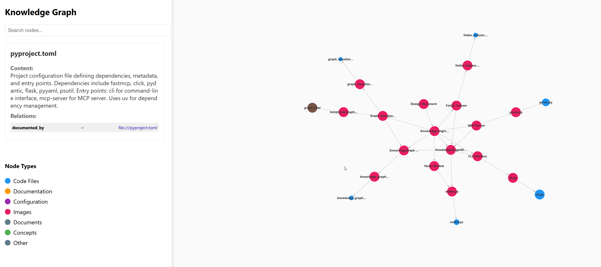

# Visualization

The Knowledge Engine provides a web-based visualization tool for exploring and interacting with the knowledge graph in real time.

## Technical Architecture

### Technology Stack
* **Frontend Framework**: React with TypeScript for component-based UI development
* **Graph Visualization**: D3.js with force-directed graph layout for interactive node visualization
* **Backend Integration**: HTTP API endpoints served by the MCP server process
* **State Management**: React hooks for local state, with server as source of truth

### Server Integration
* **Same Process**: Visualization served by the MCP server process to maintain direct access to ActiveContext
* **HTTP API**: RESTful endpoints for graph data, concept details, and traversal operations
* **Real-time Updates**: WebSocket connection for live ActiveContext synchronization
* **Data Flow**: Visualization always fetches current state from MCP server (no local caching)

### Core Endpoints
* `GET /api/graph` - Current ActiveContext graph data
* `GET /api/concept/{uri}` - Concept details and content
* `POST /api/traverse` - Traverse to a concept and update ActiveContext
* `WebSocket /ws/context` - Real-time ActiveContext updates

## Launching the Visualizer

To start the visualization server alongside your MCP server, run:

```bash
uv run mcp_server.py --workspace path/to/ws --viz
```

* This will launch a local web app (default: `http://localhost:8000`).
* The app displays the current Active Context as an interactive force-directed graph.

## Interactive Features

* **Node Exploration:**

  * Click any node to highlight it and view its details/content in a sidebar.
  * Clicking a node also triggers a `traverse` call for that node, dynamically pulling in adjacent nodes and expanding the visible graph as you explore.
* **Manual Graph Navigation:**

  * Incrementally grow the context and graph visualization by clicking from node to node, just as the LLM would discover related concepts.
* **Graph Layout:**

  * Concepts, code files, documentation, configuration, and other node types are rendered as colored nodes in a force-directed graph.
* **Sidebar Info:**

  * Selecting a node shows its summary, content, and all outgoing/incoming relations.
* **Node Types Legend:**

  * Different node types (e.g., Code Files, Documentation, Configuration, Images, Concepts, Other) are color-coded for clarity.
* **Relations:**

  * Clicking on relations or nodes traverses the graph and updates the context.
* **Search and Filter:**

  * Quickly locate nodes using the search bar at the top.

## Concept Stack Navigation

The left sidebar displays a scrollable stack of concepts representing your exploration path:

* **Traversal History**: As you click through concepts, each visited concept is added to the top of the stack
* **Scrollable Stack**: The stack grows vertically and can be scrolled to view previous concepts
* **Quick Navigation**: Click any concept in the stack to jump back to that point in your exploration
* **Visual Indicators**: 
  * Current concept is highlighted at the top
  * Previously visited concepts are shown below in chronological order
  * Each stack item shows the concept name and a brief preview
* **Stack Management**:
  * New concepts are pushed to the top
  * Clicking a previous concept removes all concepts above it (truncates the stack)
  * Maximum stack size can be configured (default: 50 concepts)
  * Clear stack option to reset exploration history

## URL-Based Navigation

The visualization supports direct URL access to specific concepts:

* **Direct Concept Access**: Navigate directly to any concept using the URL parameter:
  ```
  http://localhost:8000/?concept=concept://ws/path/to/concept
  ```
* **Automatic Traversal**: When accessing a concept via URL, the system automatically:
  * Loads the specified concept into the Active Context
  * Traverses related concepts up to the cost limit
  * Centers the visualization on the target concept
  * Updates the browser URL to reflect the current view

## Clickable Concept Links

Concept contents support interactive linking:

* **Link Detection**: The system automatically detects concept URIs in content (e.g., `concept://ws/architecture/patterns`)
* **Clickable Links**: Detected concept URIs are rendered as clickable links in the sidebar
* **Navigation**: Clicking a concept link:
  * Loads the target concept into Active Context
  * Updates the graph visualization
  * Changes the browser URL to reflect the new concept
  * Maintains browser history for back/forward navigation

## Browser History Support

The visualization maintains proper browser history for seamless navigation:

* **URL Updates**: Each concept selection updates the browser URL with the current concept
* **Back Button**: Use the browser's back button to return to previously viewed concepts
* **Forward Button**: Use the browser's forward button to navigate forward through your exploration
* **Bookmarkable URLs**: Any concept view can be bookmarked and shared via URL
* **History State**: Browser history entries include:
  * The concept URI being viewed
  * The current Active Context state
  * Graph layout and zoom level

## Implementation Details

* **URL Parameter**: `?concept=<uri>` - Direct access to specific concepts
* **Link Format**: `concept://ws/path/to/concept` - Standard concept URI format
* **History Management**: Uses browser History API for state management
* **State Persistence**: Graph layout and Active Context state preserved across navigation



> **Tip:** The visualization updates live as the graph changes, allowing both human users and LLMs to understand project structure and navigate connections. Use the URL bar to bookmark interesting concepts or share specific views with others.


